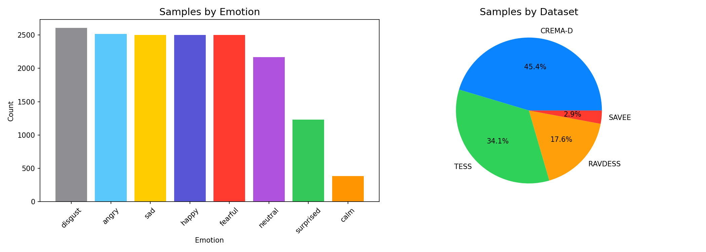
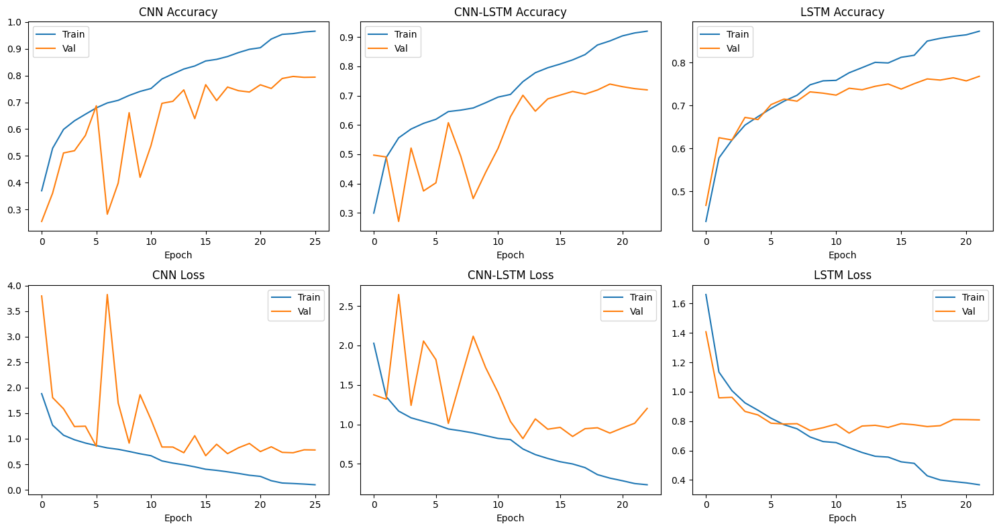
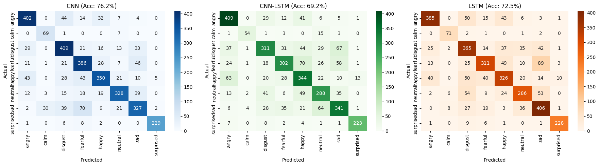
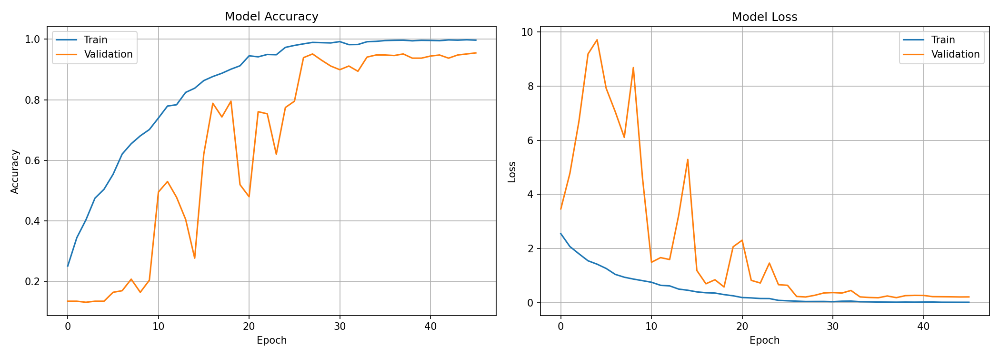
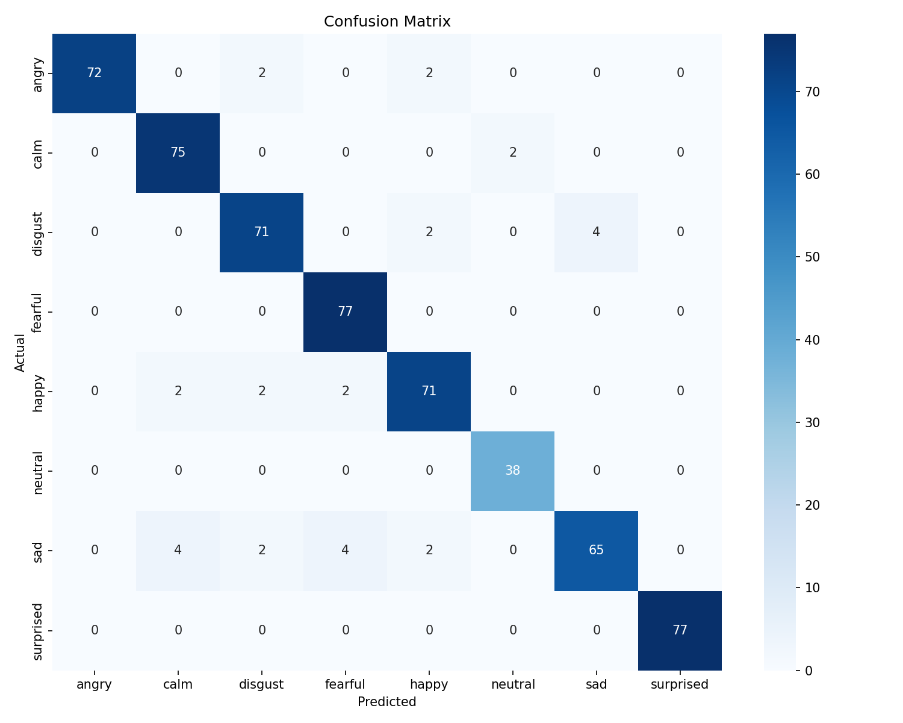
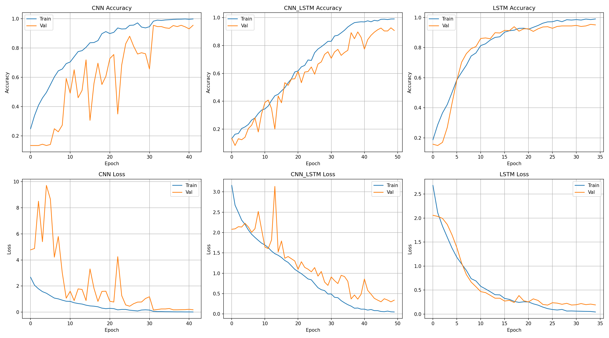
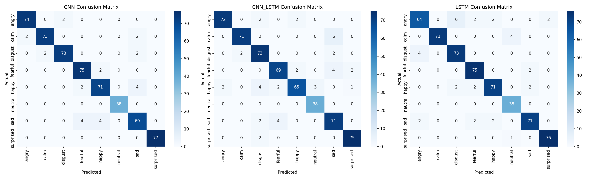

# 🎙️ Speech Emotion Recognition with AI Voice Assistant

<p align="center">
  
  
  
  
</p>

An end-to-end deep learning project that detects emotions from speech and integrates with a **Gemini-powered AI voice assistant**. Features a beautiful Apple-style web interface with real-time emotion visualization.

## ✨ Features

| Feature | Description |
|---------|-------------|
| 🧠 **Multi-Model Support** | CNN, CNN-LSTM, and LSTM architectures |
| 🎭 **8 Emotion Classes** | Neutral, Calm, Happy, Sad, Angry, Fearful, Disgust, Surprised |
| 🤖 **AI Voice Assistant** | Gemini LLM-powered empathetic responses |
| 🌍 **Multi-Language** | 12 languages supported (English, Spanish, French, German, etc.) |
| 📊 **Real-time Visualization** | Live emotion trend charts with Apple-style UI |
| 📄 **PDF Reports** | Generate detailed emotion analysis reports |
| 🎤 **Live Recording** | Record and analyze speech in real-time |
| 🔄 **WebSocket Streaming** | Real-time audio streaming with continuous detection |

## 🖼️ Screenshots

<details>
<summary>Click to view screenshots</summary>

### Main Interface
- Clean, modern Apple-style design
- Real-time emotion detection with confidence scores
- Live emotion trend visualization

### Features
- Model selection (CNN/CNN-LSTM/LSTM)
- Language selector with flags
- Session history with emotion breakdown
- PDF report generation

</details>

## 🗂️ Project Structure

```
SpeechEmotionRecognition/
├── app.py                 # Flask web application with WebSocket
├── voice_assistant.py     # Voice assistant API
├── llm_service.py         # Gemini LLM integration
├── report_generator.py    # PDF report generation
├── model.py               # CNN/LSTM model architectures
├── data_loader.py         # Data loading & feature extraction
├── train.py               # Training script
├── config.py              # Configuration settings
├── templates/
│   └── index.html         # Apple-style web interface
├── models/                # Trained model files
├── notebooks/             # Training notebooks for Colab
├── static/                # Static assets
└── requirements.txt       # Python dependencies
```

## 🚀 Quick Start

### 1. Clone the Repository

```bash
git clone https://github.com/yourusername/SpeechEmotionRecognition.git
cd SpeechEmotionRecognition
```

### 2. Create Virtual Environment

```bash
python -m venv venv
source venv/bin/activate  # On Windows: venv\Scripts\activate
```

### 3. Install Dependencies

```bash
pip install -r requirements.txt
```

**Note**: For PyAudio on macOS:
```bash
brew install portaudio
pip install pyaudio
```

### 4. Set Up Environment Variables

```bash
cp .env.example .env
```

Edit `.env` and add your Gemini API key:
```
GEMINI_API_KEY=your_api_key_here
```

Get your API key from: [Google AI Studio](https://makersuite.google.com/app/apikey)

### 5. Run the Application

```bash
python app.py
```

Open http://localhost:5000 in your browser.

## 🧠 Model Training

### Option 1: Use Pre-trained Models

Download pre-trained models from the releases page and extract to `models/` directory.

### Option 2: Train Your Own

```bash
# Train CNN model (recommended)
python train.py --model cnn

# Train CNN-LSTM hybrid
python train.py --model cnn_lstm

# Train LSTM
python train.py --model lstm
```

### Option 3: Train on Google Colab

Use the notebooks in `notebooks/` directory for training on larger datasets with GPU acceleration.

## 📊 Datasets

The models can be trained on multiple datasets:

| Dataset | Samples | Emotions | Language |
|---------|---------|----------|----------|
| RAVDESS | 1,440 | 8 | English |
| CREMA-D | 7,442 | 6 | English |
| TESS | 2,800 | 7 | English |
| SAVEE | 480 | 7 | English |

## 🎯 Model Performance

| Model | Test Accuracy | Parameters |
|-------|---------------|------------|
| CNN | ~77% | 2.1M |
| CNN-LSTM | ~75% | 3.8M |
| LSTM | ~70% | 1.5M |

*Results on combined RAVDESS + CREMA-D dataset*

### Multi-Dataset Benchmark Results (Combined Datasets)

```
============================================================
MODEL COMPARISON
============================================================
CNN:      78.02% accuracy
CNN-LSTM: 71.08% accuracy
LSTM:     73.48% accuracy
============================================================

CNN Classification Report:
              precision    recall  f1-score   support

       angry       0.82      0.88      0.85       503
        calm       0.95      0.91      0.93        77
     disgust       0.87      0.64      0.73       521
     fearful       0.76      0.72      0.74       500
       happy       0.82      0.67      0.73       500
     neutral       0.69      0.89      0.78       434
         sad       0.67      0.81      0.73       500
   surprised       0.95      0.94      0.94       246

    accuracy                           0.78      3281
   macro avg       0.82      0.81      0.81      3281
weighted avg       0.79      0.78      0.78      3281


CNN-LSTM Classification Report:
              precision    recall  f1-score   support

       angry       0.81      0.77      0.79       503
        calm       0.90      0.71      0.80        77
     disgust       0.66      0.71      0.68       521
     fearful       0.69      0.62      0.65       500
       happy       0.69      0.61      0.64       500
     neutral       0.63      0.78      0.70       434
         sad       0.68      0.71      0.69       500
   surprised       0.95      0.88      0.91       246

    accuracy                           0.71      3281
   macro avg       0.75      0.72      0.73      3281
weighted avg       0.72      0.71      0.71      3281


LSTM Classification Report:
              precision    recall  f1-score   support

       angry       0.81      0.80      0.80       503
        calm       0.87      0.90      0.88        77
     disgust       0.76      0.64      0.70       521
     fearful       0.78      0.62      0.69       500
       happy       0.67      0.64      0.66       500
     neutral       0.61      0.81      0.69       434
         sad       0.70      0.77      0.73       500
   surprised       0.93      0.96      0.94       246

    accuracy                           0.73      3281
   macro avg       0.77      0.77      0.76      3281
weighted avg       0.74      0.73      0.73      3281
```

## 📈 Plots & Results

These plots are generated during training/evaluation (including the multi-model / multi-dataset notebook runs).

### Dataset Distribution (Multi-Dataset)



### Large Dataset Training (Combined Datasets)





### Training History



### Confusion Matrix



### All Models: Training History (Multi-Dataset)



### All Models: Confusion Matrices (Multi-Dataset)



## 🌍 Supported Languages

| Language | Code | Flag |
|----------|------|------|
| English | en-US | 🇺🇸 |
| Spanish | es-ES | 🇪🇸 |
| French | fr-FR | 🇫🇷 |
| German | de-DE | 🇩🇪 |
| Italian | it-IT | 🇮🇹 |
| Portuguese | pt-BR | 🇧🇷 |
| Chinese | zh-CN | 🇨🇳 |
| Japanese | ja-JP | 🇯🇵 |
| Korean | ko-KR | 🇰🇷 |
| Hindi | hi-IN | 🇮🇳 |
| Arabic | ar-SA | 🇸🇦 |
| Russian | ru-RU | 🇷🇺 |

## 📝 API Endpoints

| Endpoint | Method | Description |
|----------|--------|-------------|
| `/api/analyze` | POST | Analyze audio file for emotion |
| `/api/chat` | POST | Chat with AI assistant |
| `/api/model` | POST | Switch emotion model |
| `/api/languages` | GET | Get supported languages |
| `/api/report` | POST | Generate PDF report |

### Example API Usage

```python
import requests

# Analyze audio
with open('audio.wav', 'rb') as f:
    response = requests.post(
        'http://localhost:5000/api/analyze',
        files={'audio': f},
        data={'language': 'en-US'}
    )
result = response.json()
print(f"Emotion: {result['emotion']}, Confidence: {result['confidence']:.2f}")
```

## 🔧 Configuration

Edit `config.py` to customize:

```python
SAMPLE_RATE = 22050      # Audio sample rate
DURATION = 3             # Audio duration in seconds
N_MELS = 128            # Mel spectrogram bands
EPOCHS = 50             # Training epochs
BATCH_SIZE = 32         # Training batch size
```

## 🐛 Troubleshooting

<details>
<summary><b>PyAudio installation issues</b></summary>

```bash
# macOS
brew install portaudio
pip install pyaudio

# Ubuntu/Debian
sudo apt-get install python3-pyaudio portaudio19-dev

# Windows
pip install pipwin
pipwin install pyaudio
```
</details>

<details>
<summary><b>Model not loading</b></summary>

- Ensure models are in the `models/` directory
- Check file names: `emotion_model_cnn.keras`, `emotion_model_cnn_lstm.keras`, etc.
- Run training first: `python train.py --model cnn`
</details>

<details>
<summary><b>Microphone not working</b></summary>

- Grant microphone permissions to your browser
- Check audio input device in system settings
- Try a different browser (Chrome recommended)
</details>

<details>
<summary><b>Gemini API errors</b></summary>

- Verify your API key in `.env` file
- Check API quota at [Google AI Studio](https://makersuite.google.com/)
- Ensure internet connectivity
</details>

## 📚 References

- [RAVDESS Dataset](https://zenodo.org/record/1188976)
- [CREMA-D Dataset](https://github.com/CheyneyComputerScience/CREMA-D)
- [Librosa Documentation](https://librosa.org/doc/)
- [TensorFlow/Keras](https://www.tensorflow.org/)
- [Google Gemini API](https://ai.google.dev/)

## 🤝 Contributing

Contributions are welcome! Please feel free to submit a Pull Request.

1. Fork the repository
2. Create your feature branch (`git checkout -b feature/AmazingFeature`)
3. Commit your changes (`git commit -m 'Add some AmazingFeature'`)
4. Push to the branch (`git push origin feature/AmazingFeature`)
5. Open a Pull Request

## 📄 License

This project is licensed under the MIT License - see the [LICENSE](LICENSE) file for details.

## 👤 Author

**Jainil Rana**

---

<p align="center">
  <b>Built with ❤️ for Speech Emotion Recognition</b>
</p>
